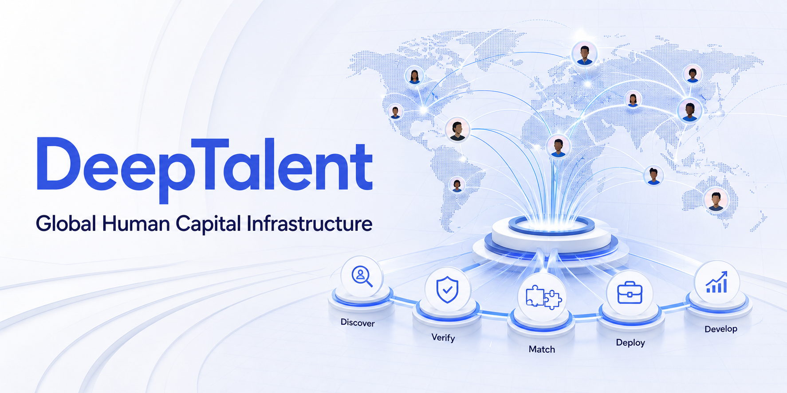
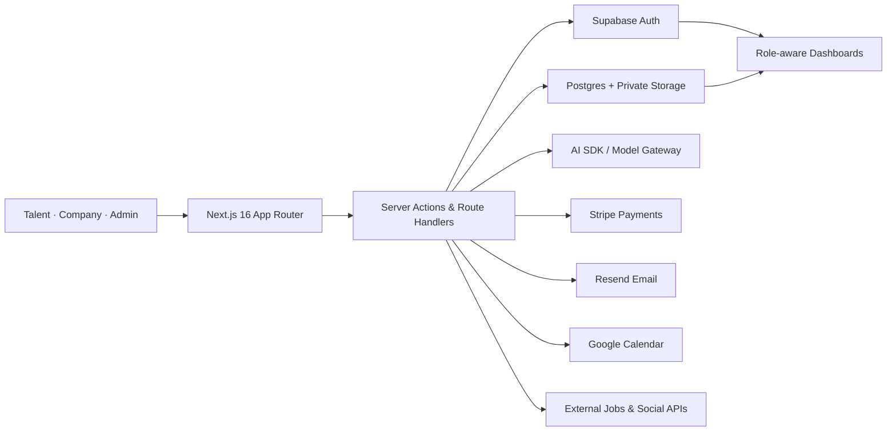

<p align="center">
  
</p>

<h1 align="center">DeepTalent</h1>

<p align="center">
  <strong>Global Human Capital Infrastructure for discovering, verifying, matching, deploying, and developing exceptional talent.</strong>
</p>

<p align="center">
  <a href="https://deeptalent.app">Live platform</a>
  ·
  <a href="#product-surfaces">Product surfaces</a>
  ·
  <a href="#architecture">Architecture</a>
  ·
  <a href="#local-development">Local development</a>
</p>

<p align="center">
  
  
  
  
  
  
</p>

---

DeepTalent is a full-stack workforce platform connecting high-potential professionals—particularly across Africa and the Global South—with companies, institutions, and governments seeking trusted global capability.

It is not simply a job board. The platform supports the complete talent lifecycle: discovery, identity and skills verification, AI-assisted assessment, intelligent matching, placement, payment, workforce operations, career development, and reporting.

## Why DeepTalent exists

The global workforce does not only have a talent shortage; it has an **access, trust, and deployment problem**.

- Employers face slow hiring cycles, rising costs, inconsistent candidate quality, and cross-border complexity.
- Capable professionals remain disconnected from credible global opportunities because of geography and fragmented verification.
- Governments and institutions need better infrastructure for converting human capital into employment and economic participation.

DeepTalent creates a trusted operating layer between these groups.

## Product surfaces

### For talent

- Role-based onboarding, secure authentication, and profile management
- Structured applications with CV and identity-document workflows
- Skills, experience, certifications, availability, and verification status
- AI-powered oral interviews with camera and text-answer fallbacks
- Career assistant, resume builder, cover-letter generator, email writer, interview preparation, and LinkedIn review
- Open-role discovery, external-job aggregation, role interest, and application tracking
- Credit-based access to premium career tooling

### For companies

- Company onboarding and dedicated hiring dashboard
- Structured talent requests across role, skills, seniority, engagement type, duration, and budget
- Verified candidate discovery and managed placement workflows
- Stripe-powered hiring and credit checkout
- Placement visibility and ongoing engagement management

### For platform operations

- Role-based admin console with user, talent, company, and approval management
- Interview scheduling and Google Calendar connection flows
- Placement, outbound application, task, deletion-request, and audit workflows
- Mass email, recurring automation, templates, delivery events, and Resend webhooks
- Role publishing, blog/content management, social integrations, and external-job ingestion
- Private-file access, legacy-data migration, and operational reporting

### Public experience

- Responsive marketing site for talent, companies, consulting, insights, roles, contact, and company information
- Motion-driven product storytelling with reduced-motion support
- Dynamic role pages and job listings
- YouTube and social-content surfaces
- Consent, privacy, terms, and security-aware response headers

## Architecture



The application uses the Next.js App Router as its delivery and orchestration layer. Supabase provides authentication, relational data, and private document storage. Route handlers isolate administrative operations and third-party integrations, while server-side access helpers keep privileged workflows away from the browser.

## Technology

| Layer | Technology |
| --- | --- |
| Web application | Next.js 16, React 19, TypeScript |
| Interface | Tailwind CSS 4, Motion, shadcn/base-ui, Lucide |
| Data and identity | Supabase Auth, Postgres, private storage |
| AI workflows | AI SDK, streaming chat, structured interview scoring |
| Payments | Stripe Checkout and credit packs |
| Email | Resend, React Email, automations and webhooks |
| Integrations | Google Calendar, YouTube, social providers, external job sources |
| Validation and charts | Zod, Recharts |
| Deployment | Vercel-compatible Next.js runtime |

## Primary routes

| Audience | Routes |
| --- | --- |
| Public | `/`, `/about`, `/companies`, `/consulting`, `/talents`, `/roles`, `/insights`, `/contact` |
| Authentication | `/auth/login`, `/auth/sign-up`, `/auth/callback` |
| Talent and company app | `/dashboard`, `/interview` |
| Hiring | `/companies/hire`, `/companies/hire/pay` |
| Administration | `/admin` and `/api/admin/*` |
| Platform APIs | `/api/interview/*`, `/api/resume/*`, `/api/tools/*`, `/api/credits/*`, `/api/webhooks/*` |

## Local development

### Prerequisites

- Node.js 20+
- pnpm via Corepack
- A Supabase project
- Optional credentials for Stripe, Resend, Google Calendar, AI, and content integrations

### 1. Install dependencies

```bash
corepack enable
pnpm install
```

### 2. Configure environment variables

Create `.env.local` in the repository root. Never commit real credentials.

```bash
# Application
NEXT_PUBLIC_APP_URL=http://localhost:3000

# Supabase
NEXT_PUBLIC_SUPABASE_URL=
NEXT_PUBLIC_SUPABASE_ANON_KEY=
SUPABASE_URL=
SUPABASE_SERVICE_ROLE_KEY=

# Payments and email
STRIPE_SECRET_KEY=
RESEND_API_KEY=
RESEND_FROM_EMAIL=
MASS_EMAIL_DOMAIN=

# Scheduled jobs
CRON_SECRET=

# Google Calendar
GOOGLE_CLIENT_ID=
GOOGLE_CLIENT_SECRET=
GOOGLE_REDIRECT_URI=http://localhost:3000/api/admin/calendar/callback

# Optional content integrations
YOUTUBE_API_KEY=
INSTAGRAM_ACCESS_TOKEN=
TIKTOK_ACCESS_TOKEN=
TWITTER_BEARER_TOKEN=
```

AI features also require the provider or gateway credentials configured for your deployment environment.

### 3. Start the application

```bash
pnpm dev
```

Open [http://localhost:3000](http://localhost:3000).

### Production build

```bash
pnpm build
pnpm start
```

## Repository structure

```text
app/
├── api/            Route handlers for platform and integrations
├── admin/          Operations console
├── auth/           Authentication flows
├── companies/      Company and hiring experiences
├── dashboard/      Role-aware application shell
├── interview/      AI interview experience
├── roles/          Dynamic role discovery
└── talents/        Talent acquisition flows

components/
├── admin/          Operational tools and management views
├── dashboard/      Talent/company dashboards and AI career tools
├── site/           Shared public-site components
└── ui/             Reusable interface primitives

lib/
├── admin/          Privileged access rules
├── email/          Resend templates and automations
├── google/         Calendar integration
├── interview/      Matching, scoring, and speech helpers
├── jobs/           External role sources
└── supabase/       Browser, server, and middleware clients
```

## Security notes

- Keep the Supabase service-role key and all third-party secrets server-only.
- Enforce Row Level Security for user-owned Supabase records.
- Validate webhook signatures before processing production payment or email events.
- Protect admin and cron endpoints with explicit authorization.
- Store resumes and identity documents in private buckets with short-lived signed URLs.
- Do not commit `.env*`, exports, customer records, or migration snapshots containing live personal data.

## Delivery history

The platform has evolved through public-site branding, role-aware authentication, talent/company dashboards, AI interviews, career tools, payments, mass communications, admin operations, consulting content, and the current Human Capital Infrastructure positioning.

See [`docs/PROJECT-CHANGELOG.md`](./docs/PROJECT-CHANGELOG.md) for the detailed delivery log.

## Contributing

1. Create a focused branch from `main`.
2. Keep changes typed and scoped to one product concern.
3. Run `pnpm build` before opening a pull request.
4. Include screenshots for interface changes and document any new environment variables.
5. Never include production data or credentials in commits.

---

<p align="center">
  <strong>DeepTalent</strong><br />
  Connecting human potential to global economic opportunity.
</p>
